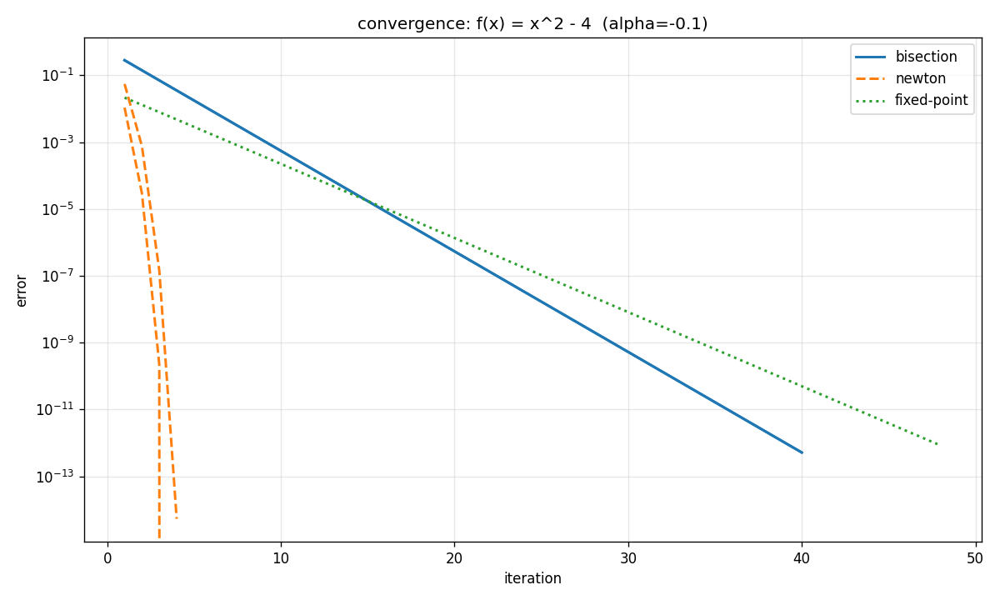
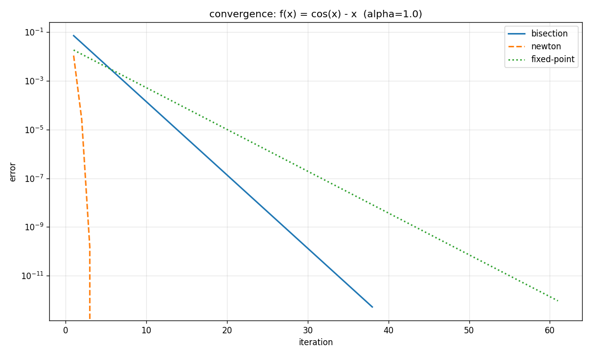
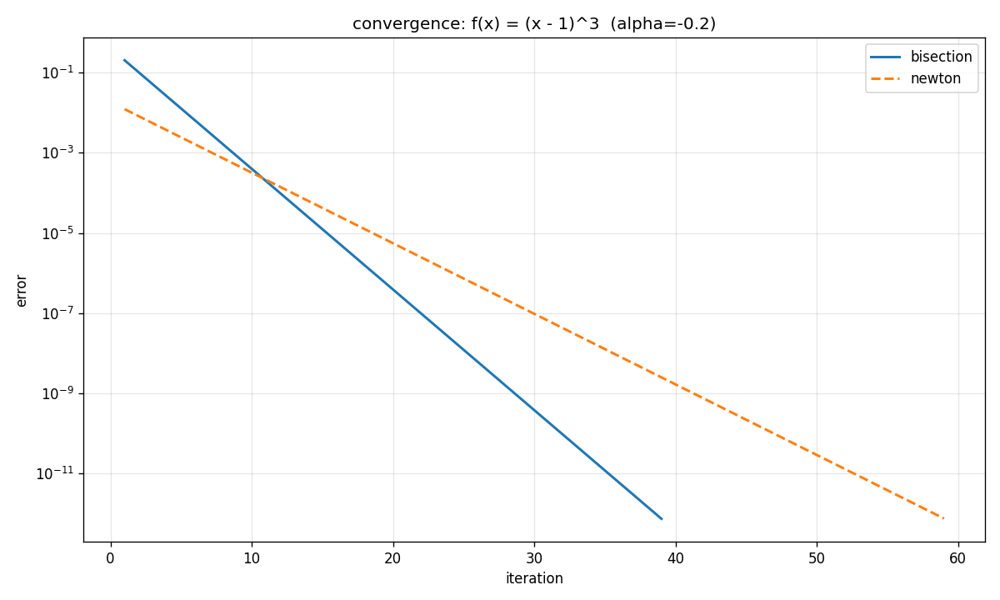
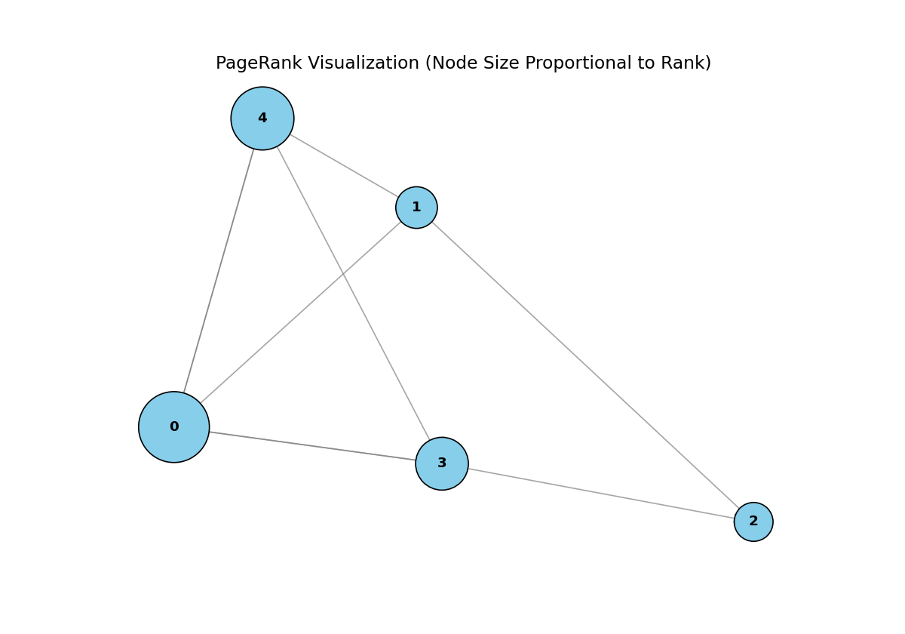
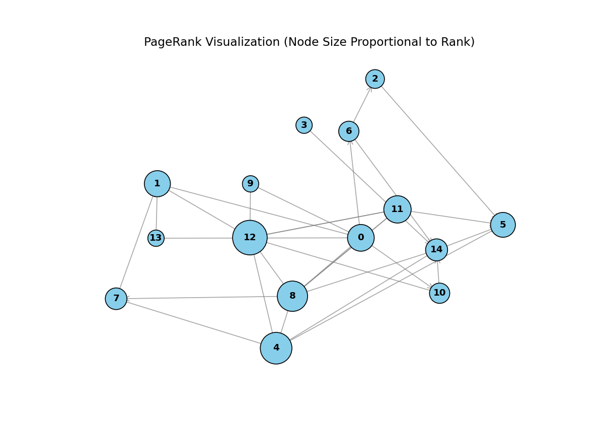
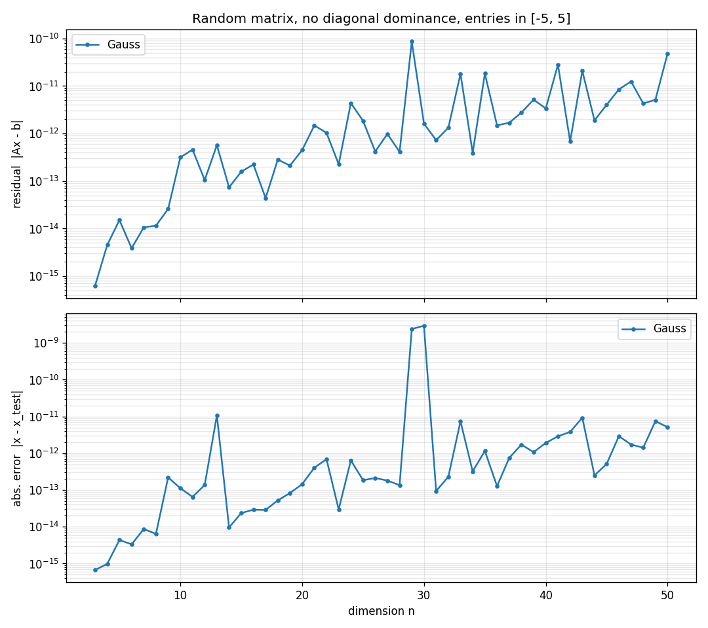
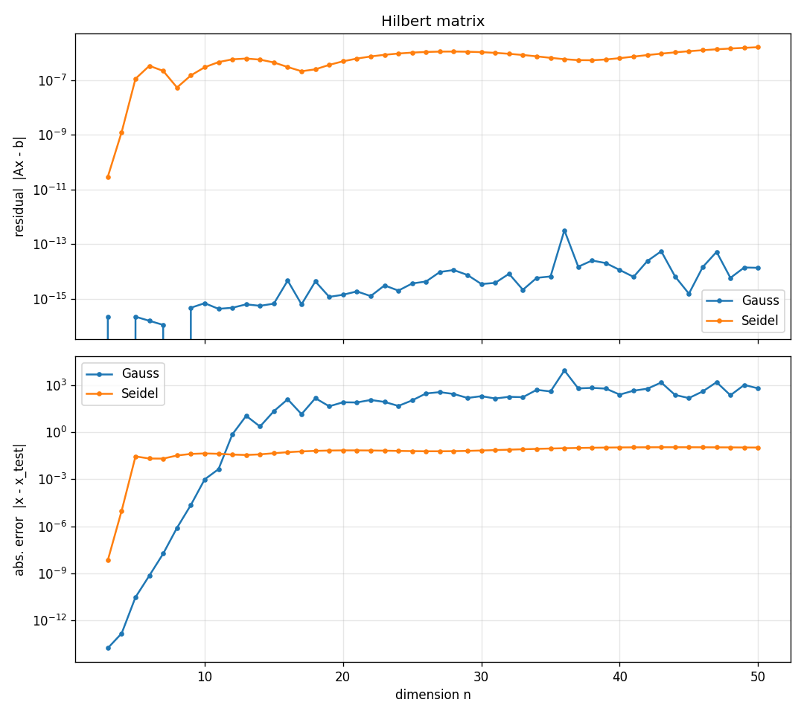
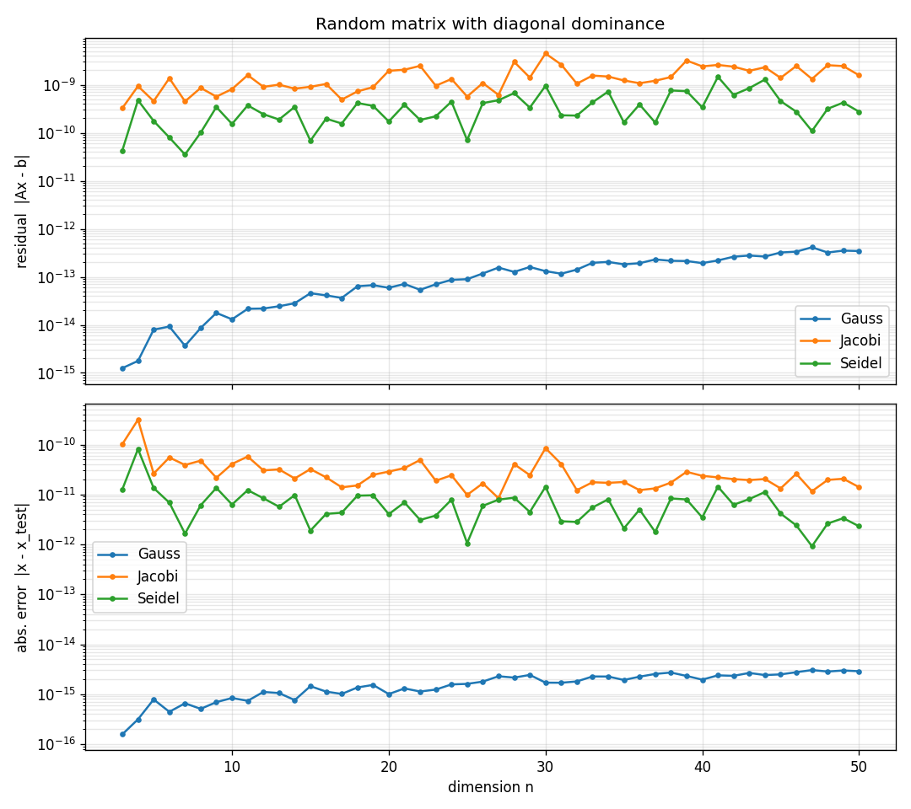

`uv run <suite>.py`

# compare bisection and fixed point convergence

[main.py](main.py)

```
fixed point ~ bisection: interval=(1, 4) x0=2.5 alpha=-0.01850
  bisection  : root=2.9999999999 err=1.16e-10 iters=32
  fixed point: root=2.9999999993 err=6.75e-10 iters=30
fixed point much slower: interval=(0, 5) x0=4.0 alpha=-0.00500
  bisection  : root=3.0000000002 err=1.75e-10 iters=33
  fixed point: root=3.0000000061 err=6.12e-09 iters=128
fixed point much faster: interval=(1, 6) x0=4.5 alpha=-0.03704
  bisection  : root=2.9999999998 err=1.75e-10 iters=33
  fixed point: root=3.0000000000 err=0.00e+00 iters=7
```

# Jacoby naive vs vectorized

[jacobi.py](jacobi.py)

```
3x3 sanity check:
  naive  (14 iter): [1.9999998732422768, -1.0000001589738368, 5.999999695774749]
  matrix (14 iter): [1.9999998732422768, -1.0000001589738368, 5.999999695774749]

100x100 benchmark, eps=1e-06:
  naive  : 561 iterations in 0.2068s
  matrix : 561 iterations in 0.0024s
  speedup: 85.9x
  max |x_naive - x_matrix|: 0.00e+00
```

# Root finding algorithms experiments

[comparison.py](comparison.py), [bisection.py](bisection.py), [fixed_point.py](fixed_point.py), [newton.py](newton.py)

```
f(x) = x^2 - 4: 2 bracket(s) in [-3.0, 3.5]  (alpha=-0.1)
  bracket [-2.1522, -1.8696]:
    bisection  : root=-2.0000000000  iters=40
    newton     : root=-2.0000000000  iters=4
    fixed-point: diverged
  bracket [1.8043, 2.0870]:
    bisection  : root=2.0000000000  iters=40
    newton     : root=2.0000000000  iters=4
    fixed-point: root=2.0000000000  iters=48

f(x) = cos(x) - x: 1 bracket(s) in [0.0, 1.5]  (alpha=1.0)
  bracket [0.7143, 0.7857]:
    bisection  : root=0.7390851332  iters=38
    newton     : root=0.7390851332  iters=4
    fixed-point: root=0.7390851332  iters=61

f(x) = (x - 1)^3: 1 bracket(s) in [-2.0, 2.7]  (alpha=-0.2)
  bracket [0.8609, 1.0652]:
    bisection  : root=1.0000000000  iters=39
    newton     : root=1.0000000000  iters=59
    fixed-point: diverged
```







# Sparse matrix solver

[seidel.py](seidel.py)

```
       n  off/row        nnz  iters    max_err
    1000        3       3995     20   2.54e-12
    1000        8       8966     19   2.23e-12
   10000        3      39992     22   3.64e-12
   10000        8      89964     20   5.46e-12
  100000        3     399995     23   4.37e-11
  100000        8     899951     21   5.82e-11
```

# PageRank experiments

[pagerank.py](pagerank.py)

```
small graph (5 nodes):
  Page 0: 0.3593
  Page 1: 0.0995
  Page 2: 0.0818
  Page 3: 0.1827
  Page 4: 0.2767

large graph (15 nodes):
  Page 0: 0.0893
  Page 1: 0.0832
  Page 2: 0.0250
  Page 3: 0.0100
  Page 4: 0.1399
  Page 5: 0.0720
  Page 6: 0.0353
  Page 7: 0.0456
  Page 8: 0.1256
  Page 9: 0.0100
  Page 10: 0.0353
  Page 11: 0.0952
  Page 12: 0.1751
  Page 13: 0.0100
  Page 14: 0.0485
```





# SLE algorithms testing suite

[SLEsuite.py](SLEsuite.py), [gauss.py](gauss.py), [jacobi.py](jacobi.py), [seidel.py](seidel.py)

```
Running: Random matrix, no diagonal dominance, entries in [-5, 5]
  -> experiment_random.png
Running: Hilbert matrix
  -> experiment_hilbert.png
Running: Random matrix with diagonal dominance
  -> experiment_diagdominant.png
Wrote results.csv (288 rows)
```

[results.csv](results.csv)







# LinReg with Gradient Descent
